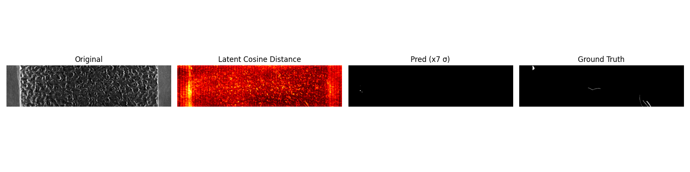
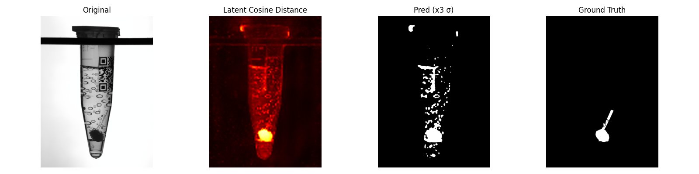

# Unsupervised Anomaly Detection on MVTec AD2

[](https://github.com/kariri8/mvtec_ad2_defect_detection/releases/tag/v1.0)

A research project comparing three unsupervised anomaly detection approaches on the [MVTec AD2](https://www.mvtec.com/company/research/datasets/mvtec-ad-2) benchmark. All methods train **only on normal images** and detect anomalies at inference by measuring how poorly a model can reconstruct or predict a given region.

---

## Project Structure

```
mvtec_ad2/
├── src/                        # All source modules
│   ├── dataset.py              # MVTecAD2Dataset (shared across experiments)
│   ├── metrics.py              # AU-PRO and Segmentation F1
│   ├── experiment1.py          # ViT-MAE pixel-space reconstruction
│   ├── experiment2.py          # Frozen DINOv3 + CNN feature predictor
│   ├── experiment3.py          # Frozen DINOv3 + Transformer predictor
│   └── train_all.py            # Full-scale parallel run (8 categories, 2 GPUs)
├── configs/                    # YAML configuration files
│   ├── experiment1.yaml
│   ├── experiment2.yaml
│   ├── experiment3.yaml
│   └── final_run.yaml
├── scripts/                    # CLI entry points
│   ├── train.py                # Train any experiment
│   ├── evaluate.py             # Evaluate a trained model
│   └── download_data.py        # Data download helper
├── tests/                      # Unit tests (pytest)
│   ├── test_metrics.py
│   └── test_models.py
├── results/                    # Saved metrics, plots, logs
├── Makefile                    # One-command shortcuts
├── requirements.txt
├── pyproject.toml              # Ruff linter config
└── .gitignore
```

---

## Setup

### 1. Clone and install

```bash
git clone https://github.com/kariri8/mvtec_ad2_defect_detection.git
cd mvtec_ad2_defect_detection
pip install -r requirements.txt
```

### 2. Download the dataset

The MVTec AD2 dataset requires accepting a licence agreement.

```bash
# Print instructions
python scripts/download_data.py

# Or auto-extract a manually downloaded archive
python scripts/download_data.py --archive /path/to/mvtec_ad2.zip --dest data/
```

Expected structure after extraction:
```
data/
└── <category>/          # can, fabric, fruit_jelly, rice, sheet_metal, vial, wallplugs, walnuts
    ├── train/good/
    ├── validation/good/
    └── test_public/
        ├── bad/
        ├── good/
        └── ground_truth/bad/
```
### 3. Model Checkpoints

Trained checkpoints are hosted on Hugging Face:
👉 https://huggingface.co/kariri8/mvtec-ad2-checkpoints

Download automatically:
```bash
python checkpoints/download_checkpoints.py
```
---

## Training

All commands can be run via `make` or directly with Python.

| Command | Description |
|---|---|
| `make train1` | Experiment 1 — ViT-MAE pixel reconstruction |
| `make train2` | Experiment 2 — DINOv3 + CNN predictor |
| `make train3` | Experiment 3 — DINOv3 + Transformer predictor |
| `make train-all` | Final run across all 8 categories (2 GPUs, parallel) |

Or explicitly:

```bash
python scripts/train.py --exp 3 --config configs/experiment3.yaml
python scripts/train.py --exp all --config configs/final_run.yaml
```

---

## Evaluation

```bash
make eval3
# or
python scripts/evaluate.py --exp 3 --config configs/experiment3.yaml
```

Results are printed to stdout and saved to `results/exp3_results.json`.

---

## Testing

```bash
make test
# or
pytest tests/ -v
```

Tests cover AU-PRO metric correctness and Transformer predictor architecture.

---

## Linting

```bash
make lint
# or
ruff check src/ scripts/ tests/
```

---

## Experiments

All three experiments share the same unsupervised protocol:
- **Train** on `train/good` only — no anomaly labels ever used
- **Threshold** derived from `validation/good` statistics: pixel flagged as anomalous if score > `μ + k·σ`
- **Evaluate** on `test_public/bad` against ground-truth masks

### Experiment 1 — ViT-MAE Pixel Reconstruction

Fine-tunes `facebook/vit-mae-base` on normal images. At inference, all 196 patches are masked and reconstructed one at a time (196 forward passes). Anomaly score = per-pixel L1 error.

**Config:** `configs/experiment1.yaml` · **Code:** `src/experiment1.py`

### Experiment 2 — DINOv3 + CNN Feature Predictor

Extracts frozen DINOv3 ViT-B/16 patch features and trains a 3-layer CNN to reconstruct masked tokens. Uses 4-pass grid inference at stride=2. Anomaly score = cosine distance between original and predicted features.

**Config:** `configs/experiment2.yaml` · **Code:** `src/experiment2.py`

### Experiment 3 — DINOv3 + Transformer Predictor (Latent MAE)

Replaces the CNN with a 4-layer Transformer encoder (8 heads, d=768, Pre-LN, GELU). Masked positions are replaced with a learnable mask token; a bicubically-interpolated 2D positional embedding is added. Same 4-pass grid inference and cosine distance scoring as Experiment 2.

**Config:** `configs/experiment3.yaml` · **Code:** `src/experiment3.py`

### Final Run — Full Scale (Experiment 3 × 8 categories)

Scales Experiment 3 to all 8 categories with early stopping (patience=3, max 50 epochs), resumable checkpointing, and parallel 2-GPU execution.

**Config:** `configs/final_run.yaml` · **Code:** `src/train_all.py`

---

## Results

### Vial

| Experiment | Model | AU-PRO ↑ | Seg F1 ↑ | Threshold |
|---|---|---|---|---|
| Exp 1 | ViT-MAE (pixel) | 0.7108 | 0.2361 | μ + 3σ |
| Exp 2 | DINOv3 + CNN | **0.8876** | **0.3153** | μ + 3σ |
| Exp 3 | DINOv3 + Transformer | 0.8875 | 0.3066 | μ + 3σ |

### Sheet Metal

| Experiment | Model | AU-PRO ↑ | Seg F1 ↑ | Threshold |
|---|---|---|---|---|
| Exp 1 | ViT-MAE (pixel) | 0.2402 | 0.1403 | μ + 5σ |
| Exp 2 | DINOv3 + CNN | **0.4746** | 0.1533 | μ + 5σ |
| Exp 3 | DINOv3 + Transformer | 0.3633 | **0.3962** | μ + 7σ |

### Average (2 pilot categories) vs. unsupervised baselines

| Method | AU-PRO ↑ | Seg F1 ↑ |
|---|---|---|
| EfficientAD | 0.587 | — |
| FioM | — | 0.360 |
| PicoNet | — | 0.420 |
| **Ours — Exp 2** | **0.681** | 0.234 |
| **Ours — Exp 3** | 0.625 | **0.351** |

> Experiment 3 was selected for the full-scale run for its substantially higher Seg F1, particularly on sheet_metal (0.153 → 0.396). Full 8-category results are pending completion of the parallel training run.

---

## Qualitative Results

Sample outputs from Experiment 3 (original | heatmap | binary prediction | ground truth):

**Sheet Metal:**


**Vial:**


---

## Metrics

- **AU-PRO (FPR ≤ 0.3):** Integrates per-region overlap across 100 thresholds up to FPR=0.3. Uses `cv2.connectedComponents` to equalise region significance. More robust to region size imbalance than pixel AUROC.
- **Segmentation F1:** Binary pixel-level F1 at the best `μ + k·σ` threshold found by sweeping k ∈ {1,3,5,7} on validation statistics.

---

## Citation

If you use this code, please cite the MVTec AD2 dataset:

```bibtex
@inproceedings{heckler2025mvtec2,
  title     = {MVTec AD 2: A Comprehensive Real-World Dataset for Unsupervised Anomaly Detection},
  author    = {Heckler, Lars and others},
  booktitle = {CVPR},
  year      = {2025}
}
```
